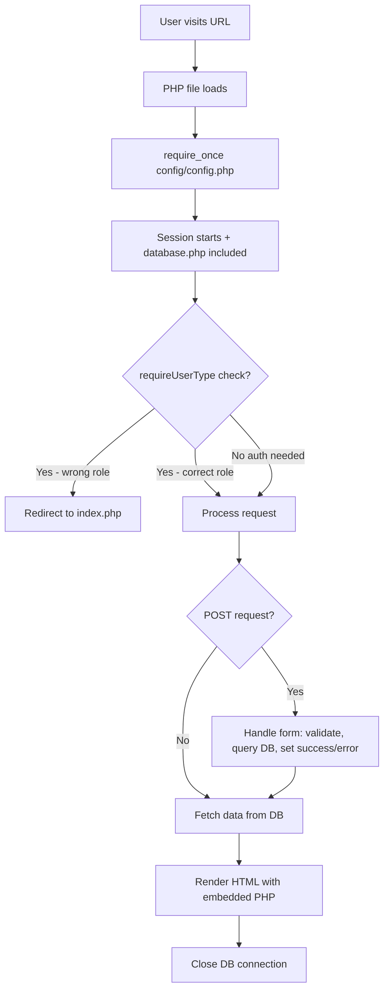
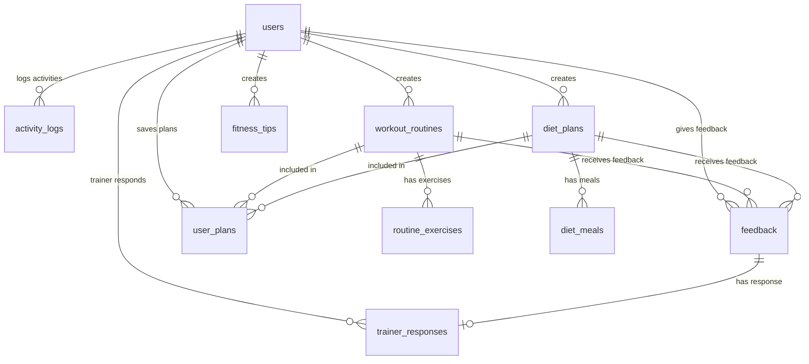

# Complete Defense Preparation Guide: Personal Fitness Tracker

---

## Part 1: Project Context and Assignment Requirements

Your project is for **CS519 (Web Engineering)** at Virtual University of Pakistan, supervised by **Muhammad Zafar Nazir**. The assignment document (`Fall 2025_CS519_11815.docx`) requires building a **Personal Fitness Tracker** web application using **PHP, HTML, CSS, JavaScript, and MySQL**.

The assignment specifies **4 user types** with specific responsibilities:

- **Admin** -- Manage trainers/users, manage fitness content (tips, routines, diet plans), monitor activity logs
- **Trainer** -- View feedback from users, respond with suggestions, recommend plan changes
- **Registered User** -- Register, log workouts/meals/water, view progress, share feedback on routines/plans
- **Unregistered User (Guest)** -- Browse public fitness content; must register to track anything

Your project implements ALL of these requirements across 24 PHP files, 1 SQL schema, 1 CSS file, and 1 README.

---

## Part 2: Tech Stack (What You Used and Why)


| Layer      | Technology                | Why                                                       |
| ---------- | ------------------------- | --------------------------------------------------------- |
| Backend    | PHP 7.4+                  | Server-side scripting language required by the assignment |
| Database   | MySQL 5.7+ (via MySQLi)   | Relational database for structured fitness data           |
| Frontend   | HTML5 + CSS3              | Page structure and styling                                |
| JavaScript | Vanilla JS + Chart.js CDN | Dynamic form toggling + progress charts                   |
| Server     | Apache (XAMPP/WAMP)       | Localhost PHP server                                      |


**Key point for defense:** The project uses NO frameworks (no Laravel, no Bootstrap) -- everything is hand-coded. This demonstrates understanding of core web technologies without relying on abstractions.

---

## Part 3: Project Architecture

The project follows a **Page Controller** pattern (also called "traditional PHP"). Each PHP file handles its own:

- Request processing (form handling)
- Database queries
- HTML output

### File-Based Routing

There is no router. The URL maps directly to files:

- `http://localhost/project1/login.php` --> serves `login.php`
- `http://localhost/project1/admin/dashboard.php` --> serves `admin/dashboard.php`

### Folder Structure and Purpose

```
PersonalFitnessTracker/
├── config/           --> Shared configuration (database connection, session, helpers)
│   ├── config.php    --> Session start, helper functions, includes database.php
│   └── database.php  --> MySQL connection (host, user, pass, dbname)
├── admin/            --> Admin-only pages (6 files)
├── trainer/          --> Trainer-only pages (3 files)
├── user/             --> Registered user pages (5 files)
├── public/           --> Pages anyone can see (3 files)
├── assets/css/       --> Single stylesheet
├── database/         --> SQL schema file
├── helpers/          --> Utility scripts
├── index.php         --> Landing page
├── login.php         --> Login page
├── register.php      --> Registration page
└── logout.php        --> Destroys session, redirects home
```

### How Every Request Works (Flow)




---

## Part 4: The Configuration Layer (The Foundation)

### [config/database.php](config/database.php)

This file does 3 things:

1. Defines database constants: `DB_HOST` (localhost), `DB_USER` (root), `DB_PASS` (empty), `DB_NAME` (fitness_tracker)
2. `getDBConnection()` -- creates and returns a MySQLi connection object
3. `closeDBConnection($conn)` -- closes the connection

**Defense tip:** MySQLi stands for "MySQL Improved". It provides both procedural and object-oriented interfaces. This project uses the object-oriented style (`$conn->query()`, `$conn->prepare()`).

### [config/config.php](config/config.php)

This is the "brain" of the application -- every single PHP file includes it. It:

1. **Starts the session** (`session_start()`) -- only if not already started
2. **Includes database.php** -- so every page has DB access
3. **Defines BASE_URL** -- `http://localhost/project1/`
4. **Provides 7 helper functions:**
  - `isLoggedIn()` -- checks if `$_SESSION['user_id']` exists
  - `getUserType()` -- returns `$_SESSION['user_type']` (admin/trainer/user)
  - `isAdmin()`, `isTrainer()`, `isUser()` -- shorthand role checks
  - `redirect($url)` -- sends HTTP Location header and exits
  - `requireLogin()` -- if not logged in, redirects to `index.php`
  - `requireUserType($type)` -- calls `requireLogin()`, then checks role; redirects if wrong

**Defense tip:** `requireUserType('admin')` at the top of every admin page ensures that even if someone manually types `admin/dashboard.php` in the URL, they cannot access it without being logged in as admin.

---

## Part 5: Database Design (10 Tables)

The database is defined in [database/schema.sql](database/schema.sql). It creates a database called `fitness_tracker` with 10 tables.

### Entity Relationship Diagram

Your ERD (`Fitness_Tracker_ERD_Final.drawio.png`) shows all entities, attributes, and relationships using standard ER notation (rectangles for entities, ellipses for attributes, diamonds for relationships).

### Table-by-Table Breakdown

**1. `users`** -- Central table for ALL user types


| Column                 | Type                           | Purpose                         |
| ---------------------- | ------------------------------ | ------------------------------- |
| id                     | INT AUTO_INCREMENT PK          | Unique identifier               |
| username               | VARCHAR(50) UNIQUE             | Login name                      |
| email                  | VARCHAR(100) UNIQUE            | Email address                   |
| password               | VARCHAR(255)                   | Bcrypt hash (never plain text!) |
| user_type              | ENUM('admin','trainer','user') | Role-based access               |
| first_name, last_name  | VARCHAR(50)                    | Display name                    |
| created_at, updated_at | TIMESTAMP                      | Audit trail                     |


**Defense tip:** All 3 roles (admin, trainer, user) are stored in ONE table with a `user_type` ENUM column. This is a common pattern called "Single Table Inheritance". The alternative would be separate tables for each role, but that would duplicate columns.

**2. `fitness_tips`** -- Public content managed by admin

- Fields: id, title, content, category, created_by (FK to users), timestamps
- `created_by` uses `ON DELETE SET NULL` -- if the admin who created it is deleted, the tip remains

**3. `workout_routines`** -- Workout plans created by trainers

- Fields: id, title, description, difficulty_level (ENUM: beginner/intermediate/advanced), duration_minutes, created_by, is_public, timestamps
- `is_public` BOOLEAN controls visibility on public pages

**4. `routine_exercises`** -- Individual exercises within a routine (one-to-many)

- Fields: id, routine_id (FK), exercise_name, sets, reps, duration_seconds, rest_seconds
- `ON DELETE CASCADE` -- deleting a routine deletes all its exercises

**5. `diet_plans`** -- Nutrition plans created by trainers

- Fields: id, title, description, created_by, is_public, timestamps

**6. `diet_meals`** -- Individual meals within a diet plan (one-to-many)

- Fields: id, diet_plan_id (FK), meal_name, calories, protein_g, carbs_g, fats_g, meal_type (ENUM: breakfast/lunch/dinner/snack)
- `ON DELETE CASCADE` -- deleting a plan deletes all its meals

**7. `activity_logs`** -- User's daily tracking entries

- Fields: id, user_id (FK), activity_type (ENUM: workout/meal/water), activity_date, workout_id (nullable FK), meal_name, calories, water_intake_ml, notes, created_at
- This is a "polymorphic" table -- the same table stores 3 types of activities. The `activity_type` column determines which fields are relevant

**8. `feedback`** -- User ratings/comments on routines or plans

- Fields: id, user_id (FK), routine_id (nullable FK), diet_plan_id (nullable FK), rating (CHECK 1-5), comment, created_at
- Either `routine_id` OR `diet_plan_id` is set, not both

**9. `trainer_responses`** -- Trainer replies to feedback

- Fields: id, feedback_id (FK), trainer_id (FK), response_text, created_at
- Links back to both the feedback and the trainer who responded

**10. `user_plans`** -- User's saved/personalized plans

- Fields: id, user_id (FK), routine_id (nullable FK), diet_plan_id (nullable FK), plan_name, start_date, end_date, created_at

### Key Relationships




### Sample Data

The schema inserts:

- 1 default admin (username: `admin`)
- 1 default trainer (username: `trainer1`)
- 5 fitness tips (Stay Hydrated, Regular Exercise, Balanced Diet, etc.)
- 3 workout routines (Morning Cardio, Full Body Strength, HIIT Workout) with 9 exercises
- 3 diet plans (Balanced, High Protein, Weight Loss) with 6 meals

---

## Part 6: Data Flow Diagram (DFD)

Your DFD (`User Activity Management-2026-02-24-015809.png`) shows how data moves through the system. It has:

**External Entities (yellow boxes):** Admin, Guest, Trainer, Registered User

**Processes (blue ovals):**

- P1: Authentication -- reads/validates against D1 (users)
- P2: Browse Content -- reads from D2-D6 (tips, routines, exercises, diet plans, meals)
- P3: Manage Accounts -- admin CRUD on D1 (users)
- P4: Manage Content -- admin writes to D2-D6
- P5: Log Activity -- registered user writes to D7 (activity_logs)
- P6: View Progress -- reads from D7 (activity_logs)
- P7: Manage Plans -- writes/reads D10 (user_plans)
- P8: Feedback and Responses -- writes/reads D8 (feedback) and D9 (trainer_responses)
- P9: Monitor System -- admin reads D8 (feedback)

**Data Stores (green cylinders):** D1-D10, corresponding to the 10 database tables.

**Defense tip:** The DFD shows that Guests can only READ from content stores (D2-D6), while Registered Users can WRITE to activity logs, feedback, and plans. Admin has WRITE access to user management and content.

---

## Part 7: Authentication System

### Registration ([register.php](register.php))

The flow:

1. If already logged in, redirect to user dashboard
2. On POST, validate: all required fields filled, passwords match, password >= 6 chars
3. Check if username/email already exists using a **prepared statement**
4. Hash the password with `password_hash($password, PASSWORD_DEFAULT)` -- this creates a bcrypt hash
5. Insert new user with `user_type = 'user'` (all self-registrations are regular users)
6. Show success message

**Defense tip:** `password_hash()` with `PASSWORD_DEFAULT` uses bcrypt. The hash looks like `$2y$10$...` (60 chars). It includes a random salt automatically, so even identical passwords produce different hashes. This is a one-way hash -- you cannot reverse it.

### Login ([login.php](login.php))

The flow:

1. If already logged in, redirect to appropriate dashboard based on role
2. On POST, validate inputs
3. Query user by username OR email (allows login with either)
4. Use `password_verify($password, $user['password'])` to check the hash
5. On success, store in session: `user_id`, `username`, `user_type`, `first_name`, `last_name`
6. Redirect to role-specific dashboard: admin -> `admin/dashboard.php`, trainer -> `trainer/dashboard.php`, user -> `user/dashboard.php`

**Defense tip:** The login uses **prepared statements** (`$conn->prepare()`) which prevent SQL injection. Instead of inserting values directly into the query string, placeholders (`?`) are used and values are bound separately.

### Logout ([logout.php](logout.php))

Just 3 lines: include config, destroy session, redirect to index. `session_destroy()` removes all session data from the server.

### Session-Based Access Control

Every protected page starts with `requireUserType('admin')` (or 'trainer' or 'user'). This function:

1. Checks if `$_SESSION['user_id']` exists (logged in?)
2. Checks if `$_SESSION['user_type']` matches the required type
3. Redirects to `index.php` if either check fails

---

## Part 8: The Landing Page ([index.php](index.php))

This is what **everyone** sees first (unless already logged in):

1. If logged in, immediately redirects to the correct dashboard
2. Shows a **hero section** with welcome message
3. Shows **4 feature cards**: Track Workouts, Monitor Nutrition, View Progress, Get Expert Advice
4. Shows **CTA (Call to Action)** section with Register/Login buttons
5. Navigation includes links to public pages: Workout Routines, Fitness Tips, Diet Plans, Login, Register

---

## Part 9: Admin Panel (6 pages)

### [admin/dashboard.php](admin/dashboard.php) -- Admin Home

- Protected by `requireUserType('admin')`
- Shows 4 stat cards: Total Users, Total Trainers, Workout Routines, Total Feedback
- Shows a table of the 10 most recent activity logs (which user did what, when)
- Navigation: Dashboard, Manage Users, Manage Trainers, Manage Content, Activity Logs, View Feedback, Logout

### [admin/manage-users.php](admin/manage-users.php) -- CRUD for Regular Users

- Lists all users with `user_type = 'user'` in a table (ID, Username, Email, Name, Created date)
- **Delete:** via `?delete=ID` in the URL, with JavaScript `confirm()` dialog
- Each user has Edit and Delete buttons

### [admin/manage-trainers.php](admin/manage-trainers.php) -- CRUD for Trainers

- **Add trainer:** Form with username, email, password, first/last name. Hashes password before INSERT
- **Edit trainer:** Same form, pre-filled. Password field is optional (blank = keep current)
- **Delete trainer:** via `?delete=ID`
- Lists all trainers in a table
- Uses hidden field `trainer_id` to distinguish add vs edit

### [admin/manage-content.php](admin/manage-content.php) -- Fitness Tips Management

- **Add fitness tip:** Form with title, content (textarea), category
- **Delete tip:** via POST form with hidden `action=delete_tip` and `tip_id`
- Lists all tips in a table with creator username
- Links to public routines/diet-plans pages for viewing other content

### [admin/activity-logs.php](admin/activity-logs.php) -- Monitor All User Activity

- Shows the 100 most recent activity logs across ALL users
- Table columns: User, Type (Workout/Meal/Water), Date, Details, Notes, Logged At
- Details column shows different info based on type (workout title, meal + calories, or water ml)

### [admin/view-feedback.php](admin/view-feedback.php) -- Read-Only Feedback View

- Shows ALL feedback from all users
- Each feedback item shows: routine/plan title, username, rating (1-5), comment, date
- Displayed as styled cards (not a table) using `.feedback-item` class

---

## Part 10: Trainer Panel (3 pages)

### [trainer/dashboard.php](trainer/dashboard.php) -- Trainer Home

- Protected by `requireUserType('trainer')`
- Shows feedback ONLY on routines/plans created by THIS trainer (`WHERE wr.created_by = $trainerId OR dp.created_by = $trainerId`)
- Each feedback item shows whether the trainer has responded (green checkmark) or needs a response (Respond button)

### [trainer/view-feedback.php](trainer/view-feedback.php) -- Detailed Feedback View

- Same filtered feedback as dashboard
- If trainer has already responded, shows the response text in a green-bordered box
- If not responded, shows a "Respond" button linking to respond-feedback.php

### [trainer/respond-feedback.php](trainer/respond-feedback.php) -- Submit Responses

- Takes `?feedback_id=N` parameter to select which feedback to respond to
- Validates that the trainer OWNS the routine/plan being reviewed
- On POST, inserts into `trainer_responses` table
- Also shows list of all feedback with respond/responded status

---

## Part 11: Registered User Panel (5 pages)

### [user/dashboard.php](user/dashboard.php) -- User Home

- Protected by `requireUserType('user')`
- Shows 3 stat cards: Total Workouts, Total Meals Logged, Water Intake (converted to liters)
- Shows table of 10 most recent activities
- Shows saved plans in a card grid

### [user/log-activity.php](user/log-activity.php) -- Activity Logging

This is the core feature. It uses **JavaScript to dynamically show/hide form fields** based on the activity type dropdown:

- **Workout:** Shows dropdown of all public workout routines
- **Meal:** Shows meal name text field and calories number field
- **Water:** Shows water intake in ml (default 250ml)

All types share: date picker and notes textarea. On submit, inserts into `activity_logs` table.

The JavaScript function `toggleActivityFields()` uses `style.display` to show/hide the relevant `<div>` blocks.

### [user/progress.php](user/progress.php) -- Charts and Stats

Uses **Chart.js** (loaded from CDN) to display 3 charts:

1. **Workout Frequency** (Line chart) -- workouts per day for last 30 days
2. **Calorie Intake** (Bar chart) -- daily calorie total for last 30 days
3. **Water Intake** (Line chart) -- daily water ml for last 30 days

Data is fetched with SQL GROUP BY queries, then embedded into JavaScript using `<?php echo json_encode($data); ?>`. Chart.js reads this JSON and renders interactive `<canvas>` charts.

**Defense tip:** The PHP runs on the server and outputs the data as JavaScript variables. By the time the browser sees it, the PHP is gone -- only the JSON data and Chart.js code remain.

### [user/plans.php](user/plans.php) -- Plan Management

- **Add plan:** Form with plan name, optional workout routine (dropdown), optional diet plan (dropdown), start date, end date
- JavaScript clears the other dropdown when one is selected (a plan is either a routine OR a diet plan)
- Displays saved plans in a card grid showing type, name, and dates

### [user/feedback.php](user/feedback.php) -- Submit and View Feedback

- **Submit:** Choose a routine OR diet plan, give a rating (1-5), write a comment
- **View:** Shows all previously submitted feedback with response count indicator
- If a trainer has responded, shows a green checkmark

---

## Part 12: Public Pages (3 pages -- Accessible by Everyone)

### [public/routines.php](public/routines.php) -- Browse Workout Routines

- No login required
- Fetches all public routines with their exercises (two-level query)
- Shows each routine as a card with: title, difficulty badge (color-coded), duration, description, exercise list
- If logged in as user, shows "Share Feedback" button on each card
- If not logged in, shows "Register to track progress" message

### [public/tips.php](public/tips.php) -- Browse Fitness Tips

- Displays all tips in a card grid
- Each card shows title, category, and content
- No login required

### [public/diet-plans.php](public/diet-plans.php) -- Browse Diet Plans

- Similar to routines -- fetches plans with their meals
- Each card shows: title, description, meal list with calories and protein
- "Share Feedback" button visible only to logged-in users

---

## Part 13: The CSS Styling ([assets/css/style.css](assets/css/style.css))

The entire visual design is in one 461-line CSS file. Key design decisions:

- **Color scheme:** Purple gradient (`#667eea` to `#764ba2`) for header, stat cards, and hero
- **Layout:** CSS Grid for cards/grids, Flexbox for navigation
- **Cards:** White background, rounded corners (10px), box shadow, hover lift effect (`translateY(-5px)`)
- **Typography:** Segoe UI font family
- **Responsive:** `@media (max-width: 768px)` breakpoint -- stacks everything vertically on mobile
- **Form inputs:** Full-width, focus state with blue border and shadow
- **Tables:** Striped hover effect, padding, border-bottom
- **Badges:** Color-coded by difficulty (green=beginner, yellow=intermediate, red=advanced)
- **Feedback items:** Left border accent (`border-left: 4px solid #667eea`)
- **Alerts:** Green for success, red for error

---

## Part 14: Security Measures

These are **critical** for your defense. Be ready to explain each:

1. **Password Hashing:** `password_hash()` with bcrypt -- passwords are NEVER stored in plain text. Even if someone steals the database, they cannot reverse the hashes.
2. **Prepared Statements:** Used in login, registration, trainer management, activity logging, feedback submission. Example: `$stmt = $conn->prepare("SELECT ... WHERE username = ?")` followed by `$stmt->bind_param("s", $username)`. The `?` placeholder is filled safely, preventing SQL injection.
3. **Session Management:** PHP sessions (`$_SESSION`) store user info server-side. The browser only gets a session ID cookie. `session_destroy()` on logout.
4. **Role-Based Access Control:** `requireUserType()` at the top of every protected page. Admin pages check for 'admin', trainer pages for 'trainer', user pages for 'user'.
5. **Output Escaping:** `htmlspecialchars()` is used when displaying any user-provided data. This prevents XSS (Cross-Site Scripting) -- if someone enters `<script>alert('hack')</script>` as their name, it will be displayed as text, not executed.
6. **Input Validation:** Password length check (>= 6), password confirmation match, required field checks, `intval()` for numeric IDs.

---

## Part 15: Your Deliverables


| Deliverable             | File                                             | What It Contains                                                                         |
| ----------------------- | ------------------------------------------------ | ---------------------------------------------------------------------------------------- |
| Assignment Brief        | `Fall 2025_CS519_11815.docx`                     | The original requirements from your supervisor                                           |
| First Deliverable (SRS) | `FinalDeliverableUpdated.docx`                   | Introduction, scope, functional/non-functional requirements, use case diagram, work plan |
| Final Report            | `FinalReport_Bc230411896.docx`                   | Complete report: SRS (Ch1), Design Document (Ch2), appendix                              |
| Final Presentation      | `FinalPresentation_bc230411896.pptx`             | PowerPoint for your defense                                                              |
| ERD                     | `Fitness_Tracker_ERD_Final.drawio.png`           | Entity-Relationship Diagram                                                              |
| Database Design         | `Personal Fitness Tracker Database Design.png`   | Relational schema diagram                                                                |
| DFD                     | `User Activity Management-2026-02-24-015809.png` | Data Flow Diagram                                                                        |
| Interface Sitemap       | `interface_sitemap.png`                          | Page navigation map                                                                      |
| Combined Diagrams PDF   | `DFD_ERD_DB_UI_Project1 (2).pdf`                 | All diagrams in one PDF                                                                  |
| Source Code             | `PersonalFitnessTracker/` folder                 | All 27 project files                                                                     |


---

## Part 16: How to Set Up and Demo the Project

1. **Install XAMPP** (or WAMP) -- this gives you Apache + PHP + MySQL
2. **Start Apache and MySQL** from the XAMPP control panel
3. **Copy project folder** to `C:\xampp\htdocs\project1\` (or equivalent on Mac: `/Applications/XAMPP/htdocs/project1/`)
4. **Import database:** Open phpMyAdmin (`http://localhost/phpmyadmin`), create database `fitness_tracker`, import `database/schema.sql`
5. **Generate passwords:** Run `php helpers/generate-password.php admin123` in terminal, copy the hash, update the admin user in the database
6. **Access:** Open `http://localhost/project1/` in your browser

### Demo Flow for Defense

1. **Guest view:** Show landing page, browse routines/tips/diet-plans without logging in
2. **Register:** Create a new user account
3. **User login:** Log in, show dashboard, log a workout/meal/water, view progress charts, save a plan, submit feedback
4. **Trainer login:** Log in as trainer, view feedback, respond to it
5. **Admin login:** Log in as admin, show stats, manage users, manage trainers, manage content, view activity logs, view feedback

---

## Part 17: Key Defense Questions and Answers

**Q: Why did you choose PHP and MySQL?**
A: The assignment required PHP, HTML, JavaScript, CSS, and MySQL. PHP is a server-side language well-suited for web applications, and MySQL is the most common relational database for PHP projects.

**Q: How does authentication work?**
A: Users register with a username, email, and password. The password is hashed using PHP's `password_hash()` (bcrypt). On login, `password_verify()` compares the entered password against the stored hash. A PHP session stores the user's ID and role for subsequent requests.

**Q: How do you prevent SQL injection?**
A: Prepared statements with parameterized queries. Instead of concatenating user input into SQL, we use `$conn->prepare()` with `?` placeholders and `bind_param()` to safely bind values.

**Q: How does role-based access work?**
A: The `user_type` ENUM in the `users` table stores whether someone is admin/trainer/user. Each protected page calls `requireUserType()` which checks the session. If the role does not match, the user is redirected.

**Q: What is Chart.js and how does it work?**
A: Chart.js is an open-source JavaScript library loaded from a CDN. PHP fetches activity data from the database, groups it by date, and outputs it as JSON. Chart.js reads this data and renders interactive line/bar charts on HTML canvas elements.

**Q: What is an ERD?**
A: Entity-Relationship Diagram -- a visual representation of database tables (entities), their columns (attributes), and how they relate to each other (relationships like one-to-many).

**Q: What is a DFD?**
A: Data Flow Diagram -- shows how data moves through the system. It has external entities (users), processes (what the system does), data stores (database tables), and data flows (arrows showing data movement).

**Q: How is the system responsive?**
A: CSS media queries detect screen width. Below 768px, the layout switches from multi-column grids to single-column stacks. Navigation changes from horizontal to vertical.

**Q: What are the non-functional requirements?**
A: Usability (clean UI), Performance (fast queries), Reliability (error handling), Security (hashing, prepared statements, XSS prevention), Compatibility (modern browsers), Maintainability (organized file structure).